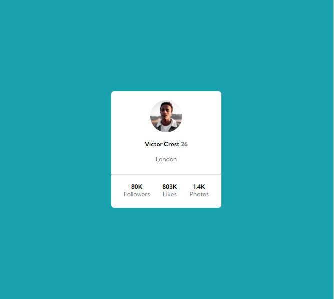
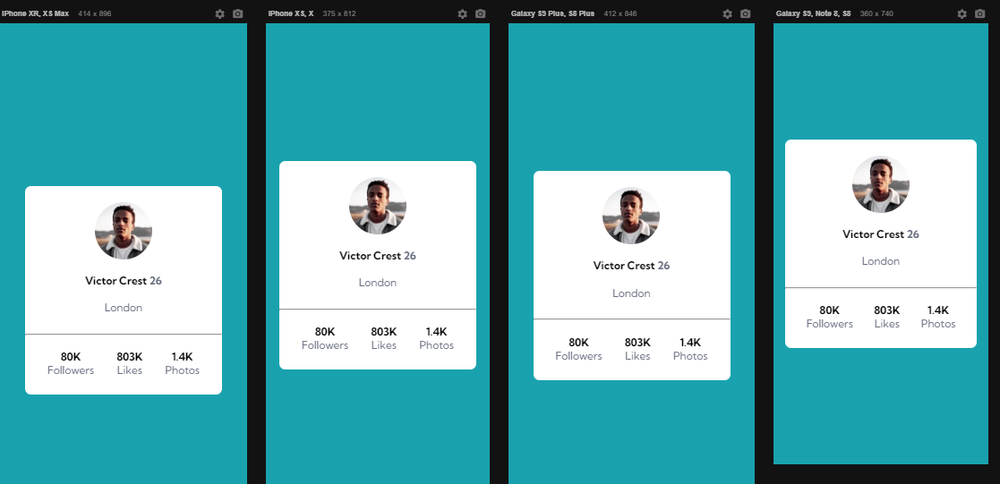

# Objetivo do projeto 
Treinar meus conhecimentos de HTML e CSS. Criando um cartõa de perfil genérico no mesmo estilo dos desafios do "<a href="https://www.frontendmentor.io/" target="_blank">FrontEndMentor</a>".
 
Projeto feito com o auxílio do curso "DevQuest" feito pelos irmãos gêmeos do "<a href="https://www.youtube.com/c/devemdobro" target="_blank">DevEmDobro</a>".

# Desafios do projeto
Foi a primeira vez que eu realizei um projeto de css flex box utilizando o mix de ul e li no projeto para alinhar da melhor maneira possível, apesar de já ter treinado muito nas aulas do curso, foi uma realização consegui fazer da melhor maneira.

# Tecnologias utilizadas
<li> HTML
<li> CSS

# Layout do projeto pronto
 
<li> Layout desktop
 

 
 
<li> Layout mobile
 

